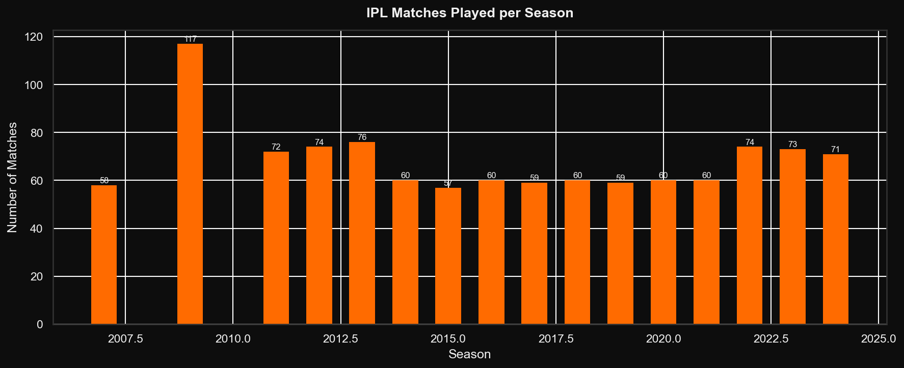
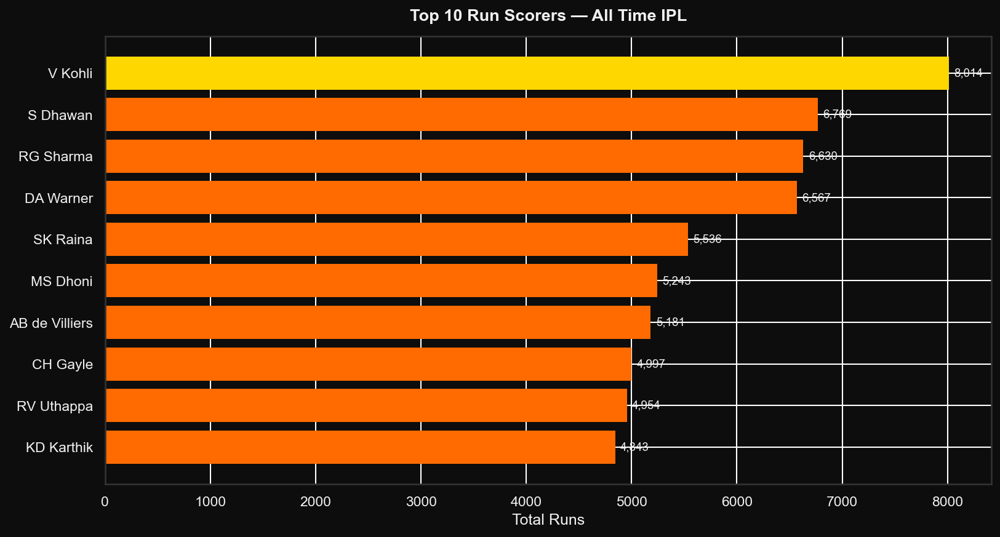
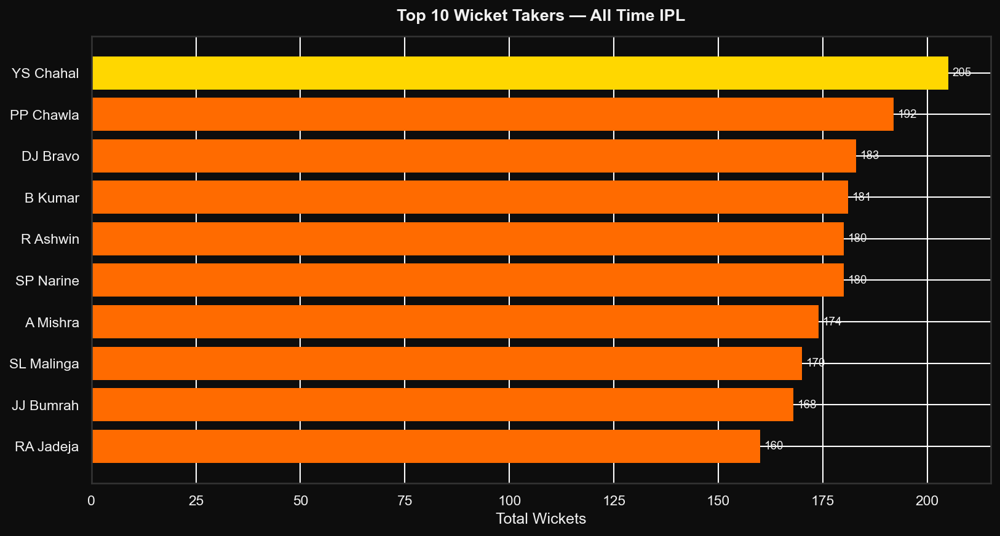
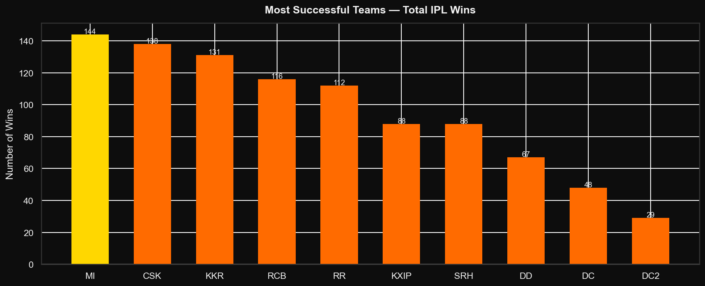

# 🏏 IPL Data Analysis (2008–2020)


> **Exploratory data analysis of 13 IPL seasons** — uncovering trends in batting, bowling, team performance, toss decisions, and venue statistics using Python.

---

## 📌 Overview

The Indian Premier League (IPL) is one of the most watched cricket leagues in the world. This project dives into **over 800 matches and 180,000+ ball-by-ball deliveries** to answer:

- Who are the greatest batsmen and bowlers in IPL history?
- Which team dominates the IPL?
- Do teams prefer to bat or field after winning the toss?
- Which venues host the most matches?
- How has the number of matches grown each season?

---

## 📊 Key Findings

| Finding | Detail |
|---------|--------|
| 🏆 Most successful team | Mumbai Indians |
| 🏏 Top run scorer | Virat Kohli |
| 🎳 Top wicket taker | SL Malinga |
| 🪙 Toss preference | Teams prefer to field first |
| 🏟 Top venue | Wankhede Stadium, Mumbai |
| 📈 IPL growth | Matches increased consistently season over season |

---

## 📁 Project Structure

```
ipl-analysis/
│
├── data/
│   ├── matches.csv          ← Download from Kaggle
│   └── deliveries.csv       ← Download from Kaggle
│
├── notebooks/
│   └── ipl_analysis.ipynb   ← Full walkthrough with narrative
│
├── outputs/
│   ├── 01_matches_per_season.png
│   ├── 02_top_batsmen.png
│   ├── 03_top_bowlers.png
│   ├── 04_team_wins.png
│   ├── 05_toss_analysis.png
│   └── 06_venue_analysis.png
│
├── analysis.py              ← Standalone script
├── requirements.txt
├── .gitignore
└── README.md
```

---

## 🚀 Getting Started

### 1. Clone the repo
```bash
git clone https://github.com/vishnumutha1410/ipl-analysis.git
cd ipl-analysis
```

### 2. Install dependencies
```bash
pip install -r requirements.txt
```

### 3. Download the dataset
Get the **IPL Complete Dataset** from Kaggle:  
👉 https://www.kaggle.com/datasets/patrickb1912/ipl-complete-dataset-20082020

Place both `matches.csv` and `deliveries.csv` inside the `data/` folder.

### 4. Run the analysis

**Option A — Python script:**
```bash
python analysis.py
```

**Option B — Jupyter Notebook:**
```bash
jupyter notebook notebooks/ipl_analysis.ipynb
```

---

## 📸 Sample Visualizations

### Matches per Season


### Top 10 Run Scorers


### Top 10 Wicket Takers


### Most Successful Teams


---

## 🛠 Tech Stack

- **Python 3.10+**
- **Pandas** — data wrangling and aggregation
- **Matplotlib** — custom IPL-themed dark charts
- **Seaborn** — statistical visualizations
- **Jupyter** — interactive notebook environment

---

## 💡 Future Work

- [ ] Win probability model using match conditions
- [ ] Player performance trend over seasons
- [ ] Best playing XI selector based on stats
- [ ] Power BI / Tableau dashboard

---

## 📄 Dataset

- **Source**: [IPL Complete Dataset — Kaggle](https://www.kaggle.com/datasets/patrickb1912/ipl-complete-dataset-20082020)
- **Coverage**: 2008–2020 (13 seasons)
- **Size**: ~800 matches, ~180,000 deliveries

---

## 📝 License

MIT License — see [LICENSE](LICENSE) for details.

---

## 🙋 Author

**Vishnu Vardhan Mutha**  
[GitHub](https://github.com/vishnumutha1410) · [LinkedIn](https://linkedin.com/in/vishnuvardhanmutha)

---
*If you found this useful, please ⭐ the repo!*
